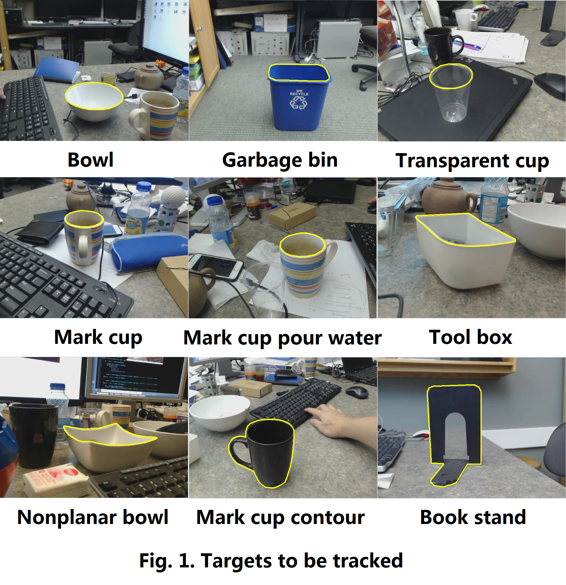

Dataset of Salient Closed Boundary Tracking
====

This dataset contains nine video sequences captured by webcam for salient closed boundary tracking.They are used in our paper 
	` "Real-Time Salient Closed Boundary Tracking via Line Segments Perceptual Grouping, Xuebin Qin, Shida He, Camilo Perez Quintero, Abhineet Singh, Masood Dehghan and Martin Jagersand." ` 
which is submitted to IROS 2017.

 

FPS: 30 
Frame size: 640(width) x 480(height) 
There are 9598 frames in total. 

Frame number of each sequence:  

1.BookStand.avi:		899 
2.Bowl.avi:			1079 
3.GarbageBin.avi:		924 
4.MarkCup.avi:			859 
5.MarkCupContour.avi:		1226 
6.MarkCupPourWater.avi:		971 
7.NonplanarBowl.avi: 		1454 
8.ToolBox.avi:			1135 
9.TransparentCup.avi: 		1051 

For each frame, the ground truth is a polygon which represents a salient closed boundary. 

The <xxx_TrackingGroundTruth.txt> are organized as follows: 
points_number x1 y1 x2 y2 x3 y3 ... ... xn yn 

These polyogns are annotated frame by frame manually, and they have pixel-level accuracy. 

If you have any problems or suggestions, feel free to contact us. 

The code can be found https://github.com/NathanUA/SlientClosedBoundaryTracking. 

Contacts
---
Xuebin Qin 
Department of Computing Science 
University of Alberta 
Edmonton, AB, Canada, T6G 2E8 

Email: 
xuebin@ualberta.ca 
xuebinua@gmail.com 